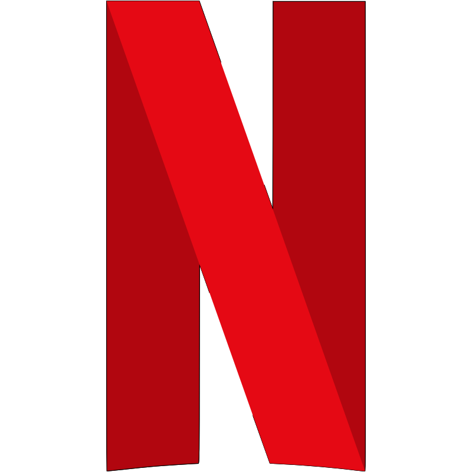

  

  <h3 align="center">Netflix Clone</h3>

  

    <a href="">View Demo</a>
    ·
    <a href="https://github.com/Pabl0Parra/Netflix-clone-React-Typescript/issues">Report Bugs</a>
    ·
    <a href="https://github.com/Pabl0Parra/Netflix-clone-React-Typescript/issues">Request Features</a>
  

  
Table of Contents

  <ol>
    <li>
      <a href="#prerequests">Pre requeriments</a>
    </li>
    <li>
      <a href="#which-features-this-project-deals-with">Features this project deals with</a>
    </li>
    <li><a href="#third-party-libraries-used-except-for-react-and-rtk">Third Party libraries used except for React and RTK</a></li>
    <li>
      <a href="#contact">Contact</a>
    </li>
  </ol>

 

  
  
Home Page

  
  
Mini Portal

  
  
Detail Modal

  
  
Grid Genre Page

## Prerequests

- Create an account if you don't have on [TMDB](https://www.themoviedb.org/).
  Because I use its free API to consume movie/tv data.
- And then follow the [documentation](https://developers.themoviedb.org/3/getting-started/introduction) to create API Key
- Finally, if you use v3 of TMDB API, create a file named `.env.local`, and copy and paste the content of `.env.example`.
  And then paste the API Key you just created.

## Which features this project deals with

- How to create and use [Custom Hooks](https://reactjs.org/docs/hooks-custom.html)
- How to use [Context](https://reactjs.org/docs/context.html) and its provider
- How to use lazy and Suspense for [Code-Splitting](https://reactjs.org/docs/code-splitting.html)
- How to use [Portal](https://reactjs.org/docs/portals.html)
- How to use [Fowarding Refs](https://reactjs.org/docs/forwarding-refs.html) to make components reusuable
- How to create and use [HOC](https://reactjs.org/docs/higher-order-components.html)
- How to customize default theme of [MUI](https://mui.com/)
- How to use [RTK](https://redux-toolkit.js.org/introduction/getting-started)

## Third Party libraries used except for React and RTK

- [MUI(Material UI)](https://mui.com/)
- [framer-motion](https://www.framer.com/docs/)
- [react-player](https://github.com/CookPete/react-player)
- [react-infinite-scroller](https://github.com/danbovey/react-infinite-scroller)
- [react-slick](https://react-slick.neostack.com/)
- [use-immer](https://github.com/immerjs/use-immer)

## Contact

- frontend.bcn.dev@gmail.com
- [Linkedin](https://www.linkedin.com/in/pablo-parra-bcn/)

> **Note**
> There might be several things to improve.
> This project aims to show how to use the features mentioned above.
> So I welcome anyone who wants to contribute.
